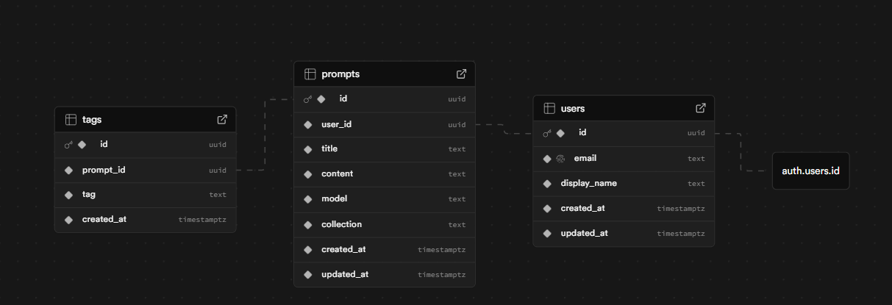
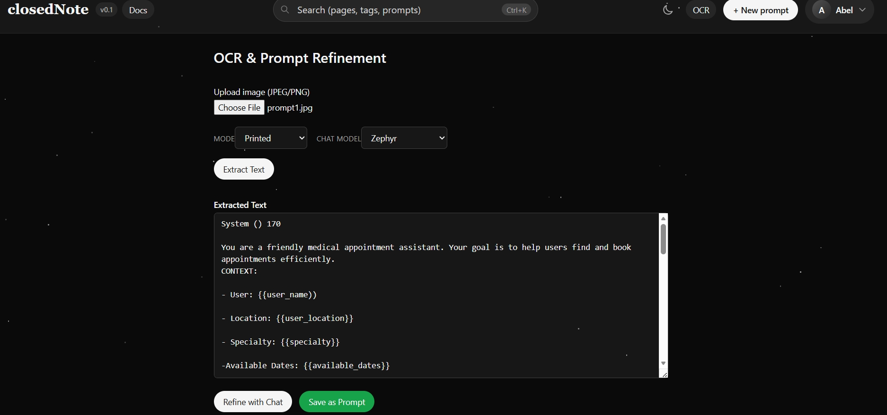
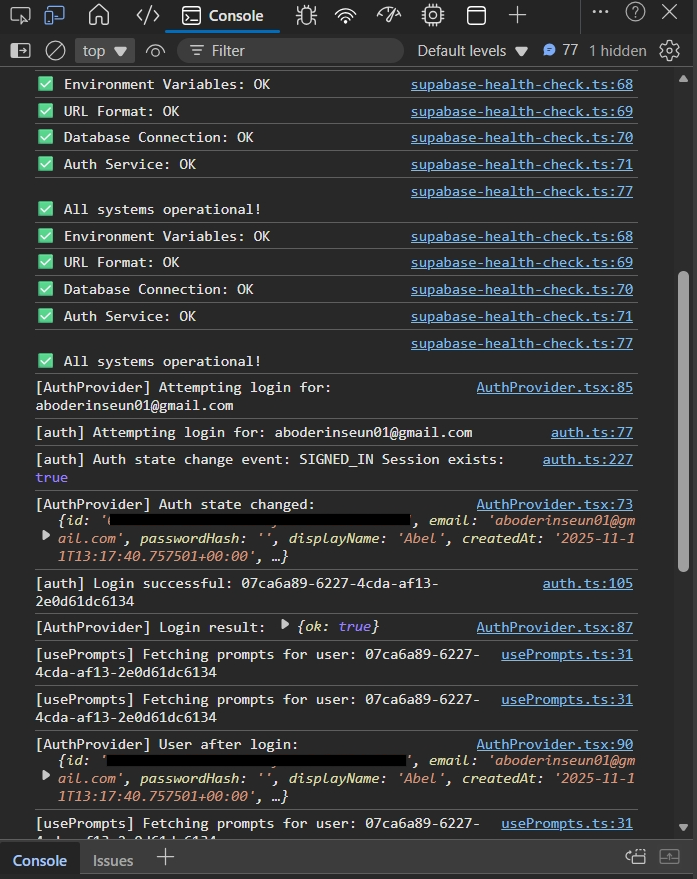

# 🗒️ closedNote

> *"Because even ChatGPT forgets sometimes…"*

---

### 👋 What is closedNote?

closedNote is a simple web app for **saving, organizing, and re-using your best prompts**, built for *students, teachers, engineers, prompt engineers, prompt tutors, and even regular folks like my mum 😅.*

It's the one place you can finally dump all your fire prompts without digging through old chats or screenshots.
A calm home for all your creativity.

---

### 💡 The Story

I got tired of re-engineering my "perfect ChatGPT prompts" every time I needed a particular kind of answer.
Then my mum started doing the same thing (don't ask how she got into it 😭).
Then my grandma.
Then my classmates.

Meanwhile, prompt engineers were dropping crazy tips on X (Twitter) and Stack Overflow, but I had nowhere to store them neatly.

So, I built one.
That's what **closedNote** is all about, a small home to make **prompt saving easier for everyone**. 🙂🙂

Completely open source, open to contributions, and continuously improving.

---

### ⚙️ Tech Stack

<div align="center">

| Frontend | Backend | AI/OCR | Database | Deployment |
|:--------:|:-------:|:------:|:--------:|:----------:|
| <br/>**Next.js 14** | <br/>**Supabase** | <br/>**Hugging Face** | <br/>**PostgreSQL** | <br/>**Vercel** |
| <br/>**React 18** | JWT Auth | TrOCR Models | RLS Policies | Auto Deploy |
| <br/>**TypeScript** | API Routes | Zephyr Chat | Real-time Sync | Edge Functions |
| <br/>**Tailwind CSS** | Storage | Tesseract.js | Migrations | Preview URLs |

</div>

---

### 🖥️ Desktop View


> clean, minimal, and distraction-free, because prompts deserve peace too 😌

---

### 📱 Mobile View

|                                                   |                                                   |
| ------------------------------------------------- | ------------------------------------------------- |
|  |  |

> fully responsive, works smoothly on mobile for on-the-go creativity

---

### 🗄️ Database Setup (Supabase + PostgreSQL)

closedNote runs on **Supabase**, which provides both authentication and secure cloud storage using **Row Level Security (RLS)**, meaning no one can see your notes but you.

#### 🧾 Example Schema Snippets


#### 🏛️ Public Schema



_Public schema diagram showing tables and relationships used by closedNote._

> Every user's data is tied to their `auth.uid()`. No mix-ups, no leaks.

---

### 🧠 Features

* 🏠 **Local + Cloud Storage**, works offline, syncs later
* 🔍 **Search & Filter**, find prompts in seconds
* 🏷️ **Tag System**, group prompts by category or mood
* 💾 **One-Click Copy**, paste straight into ChatGPT, Claude, Cursor, etc.
* 🔒 **Private by Default**, RLS ensures your data stays yours
* 🖼️ **Image to Text (OCR)**, turn screenshots into prompts instantly
* 🌍 **Open Source Forever**, fork it, remix it, teach with it

---

### 🖼️ Image to Text (OCR)

closedNote lets you turn screenshots, photos, and handwritten notes into prompts without retyping everything.

**How it works:**

1. You upload an image (screenshot, photo of notes, whatever)
2. The app tries to send it to **Hugging Face OCR API** (our planned primary engine)
3. If that fails or isn't set up yet, it falls back to **Tesseract.js** running right in your browser
4. The extracted text shows up, you can edit it if needed
5. One click saves it as a prompt in your library



**Current Status:**

Right now, Tesseract is the stable workhorse while we finalize the Hugging Face integration (API hiccups, you know how it goes). The code is structured so swapping between both or combining them later is super easy.

**Why This Matters:**

Ever find yourself screenshotting a great prompt from Twitter or a Discord server, then having to manually retype the whole thing? Yeah, me too. That's done now.

**The Details:**

When you upload an image:
* **Online Mode**: Sends to Hugging Face TrOCR (Microsoft's printed/handwritten models)
* **Offline Mode**: Falls back to Tesseract.js (runs locally, no internet needed)
* **AI Refinement**: After extraction, you can clean up the text with Zephyr or Mixtral chat models
* **Auto-Save**: Tagged with "ocr" so you can find all your screenshot-based prompts later


*Debug console showing OCR processing flow and state management*

**What's Cool:**

The architecture is built with a **primary + fallback** mindset. Even if Hugging Face is down, you're not blocked. Even if you're offline on a train, Tesseract still works. No single point of failure.

---

### 🧪 How to Run Locally

```bash
git clone https://github.com/aboderinsamuel/closedNote.git
cd closedNote
npm install
cp .env.example .env.local
# Add your Supabase keys inside .env.local
# (Optional) Add HUGGINGFACE_API_KEY for online OCR
npm run dev
```

Then visit 👉 **[http://localhost:3000](http://localhost:3000)**

**OCR Setup (Optional):**
- Get a free Hugging Face token from [huggingface.co/settings/tokens](https://huggingface.co/settings/tokens)
- Add `HUGGINGFACE_API_KEY=hf_yourtoken` to `.env.local`
- That's it! OCR will automatically use Hugging Face when available, or fall back to Tesseract

---

### 🚀 Deploy to Production

#### Quick Deploy with Vercel (Recommended)

[](https://vercel.com/new/clone?repository-url=https://github.com/aboderinsamuel/closedNote)

**Important Steps:**
1. Click the button above or go to [Vercel](https://vercel.com)
2. Import your forked repository
3. Add environment variables:
   - `NEXT_PUBLIC_SUPABASE_URL`
   - `NEXT_PUBLIC_SUPABASE_ANON_KEY`
4. Deploy!

**After Deployment:**
- Go to your Supabase Dashboard → Authentication → URL Configuration
- Add your Vercel domain to **Redirect URLs**: `https://your-app.vercel.app/**`
- Update **Site URL** to: `https://your-app.vercel.app`

📖 **Detailed deployment guide:** See [VERCEL_DEPLOYMENT.md](./VERCEL_DEPLOYMENT.md)

---

### 🧰 Developer Notes

closedNote is **developer-friendly**:

* Uses clean React hooks and modular components
* Minimal Tailwind classes (no spaghetti CSS)
* Supabase client handles all Auth + DB calls
* Easy to self-host or extend

---

### 🔒 Security Highlights

* ✅ Row Level Security (RLS) enabled on all tables
* ✅ Auth via Supabase (JWT-secured)
* ✅ `.env.local` excluded from Git (already in `.gitignore`)
* ✅ HTTPS enforced on production (Vercel)
* ✅ Minimal data collection — only email + prompts

---

### 🧑🏽‍💻 Contributing

closedNote is **completely open source** and **open for amendments**.
The goal is to make prompt saving easier for *everyone*, not just developers.

If you've got ideas, dark mode, AI tag suggestions, team sharing, prompt history, whatever, you're welcome to hop in!

#### 📚 Contributing Resources

- **[Code of Conduct](./docs/CODE_OF_CONDUCT.md)** - Our community standards
- **[Roadmap](./docs/ROADMAP.md)** - Future features and project vision
- **[Release Strategy](./docs/RELEASES.md)** - How we ship updates
- **[Issue Templates](./.github/ISSUE_TEMPLATE/)** - Report bugs or request features
- **[Pull Request Template](./.github/PULL_REQUEST_TEMPLATE.md)** - Submit your changes

```bash
# Steps to contribute
1. Fork this repo 🍴
2. Create a branch (feature/my-new-idea)
3. Commit & push
4. Open a pull request 🚀
```

---

### 👨🏽‍🎓 About the Developer

Built by [**Samuel Aboderin**](https://github.com/aboderinsamuel),
Computer Engineering student at **UNILAG 🇳🇬**,
who just got tired of losing his prompts (and decided to fix it for everyone else too).

Reach me on [LinkedIn](https://www.linkedin.com/in/samuelaboderin).

---

### 🧾 License

MIT License, use it, remix it, or improve it.
Just don't lock it behind a paywall. 🙏🏽

---

**closedNote**, *because your prompts deserve better than browser history.* ✨
